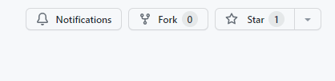
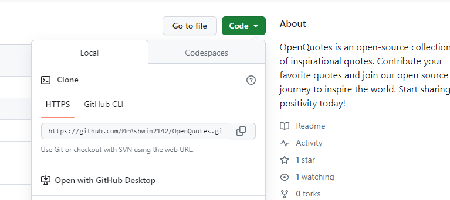

# OpenQuotes
<!-- ALL-CONTRIBUTORS-BADGE:START - Do not remove or modify this section -->
[](#contributors-)
<!-- ALL-CONTRIBUTORS-BADGE:END -->

**Welcome to OpenQuotes - Share Your Inspiration!**

This project aims to simplify and guide the way beginners make their first open source contribution. If you're looking to contribute your favorite quotes and be part of our journey to inspire the world, follow the steps below.

**Live App Link:** [OpenQuotes Live App](https://mrashwin2142.github.io/OpenQuotes/)

## Contributors
Thanks to all our amazing contributors who have helped make OpenQuotes an inspiring and collaborative project!

<!-- ALL-CONTRIBUTORS-LIST:START - Do not remove or modify this section -->
<!-- prettier-ignore-start -->
<!-- markdownlint-disable -->
<table>
  <tbody>
    <tr>
       <td align="center" valign="top" width="14.28%"><a href="https://ashwin-      
portfolioo.netlify.app/#"><br /><sub><b>Ashwin Dhangar</b></sub></a><br /><a href="https://github.com/MrAshwin2142/OpenQuotes/commits?author=MrAshwin2142" title="Code">💻</a> <a href="#content-MrAshwin2142" title="Content">🖋</a> <a href="#design-MrAshwin2142" title="Design">🎨</a> <a href="#ideas-MrAshwin2142" title="Ideas, Planning, & Feedback">🤔</a</td>
      <td align="center" valign="top" width="14.28%"><a href="https://github.com/codeGallery01"><br /><sub><b>codeGallery01</b></sub></a><br /><a href="https://github.com/MrAshwin2142/OpenQuotes/commits?author=codeGallery01" title="Code">💻</a></td>
     
    
  </tbody>
</table>

<!-- markdownlint-restore -->
<!-- prettier-ignore-end -->

<!-- ALL-CONTRIBUTORS-LIST:END -->
<!-- ALL-CONTRIBUTORS-LIST:START - Do not remove or modify this section -->
<!-- prettier-ignore-start -->
<!-- markdownlint-disable -->

<!-- markdownlint-restore -->
<!-- prettier-ignore-end -->

<!-- ALL-CONTRIBUTORS-LIST:END -->

## How to Contribute


### 1. Fork this Repository

If you don't have Git on your machine, [install it](https://docs.github.com/en/get-started/quickstart/set-up-git).

- Fork this repository by clicking on the "Fork" button at the top of this page. This creates a copy of the repository in your GitHub account.
- Don't forget to click the "Star" button at the top right of the repository page to show your support!
### 2. Clone the Repository


- Clone your forked repository to your local machine. In your GitHub account, navigate to your forked repository and click the "Code" button. Copy the URL.

- Open your terminal and run the following command, replacing `"url you just copied"` with the URL you copied:

```shell
git clone "url you just copied"
```
For example:

```shell
git clone git@github.com:this-is-you/openquotes.git
```
### 3. Create a Branch
Change to the repository directory on your computer (if you're not already there):

```shell
cd openquotes
```
Now create a new branch for your contribution:

```shell
git switch -c add-your-name
```

Replace add-your-name with a branch name that describes your contribution.

### 4. Make Changes and Commit
Open the quotes.js file in a text editor, add your favorite quote and your name to the array of quotes.

Save the file, and then in your terminal, execute the following commands:

```shell
git status
git add quotes.js
git commit -m "Add your quote and name to the collection"
```
Replace "Add your quote and name to the collection" with a meaningful commit message.

### 5. Push Changes to GitHub
Push your changes to your GitHub repository with:

```shell
git push -u origin add-your-name
```

### 6. Create a Pull Request
Navigate to your GitHub repository.
Click the "Pull Request" button.
Follow the prompts to create a pull request.

### 7. Celebrate Your Contribution
You've completed the standard fork, clone, edit, and pull request workflow. Congrats on your contribution to OpenQuotes! Share your contribution with friends and followers and celebrate your open source journey.

### 8. Spread the Inspiration
Share your contribution and our project with your friends and followers. Encourage them to join the open source community and start their own journey. Together, we can inspire and make the world a better place, one quote at a time.
